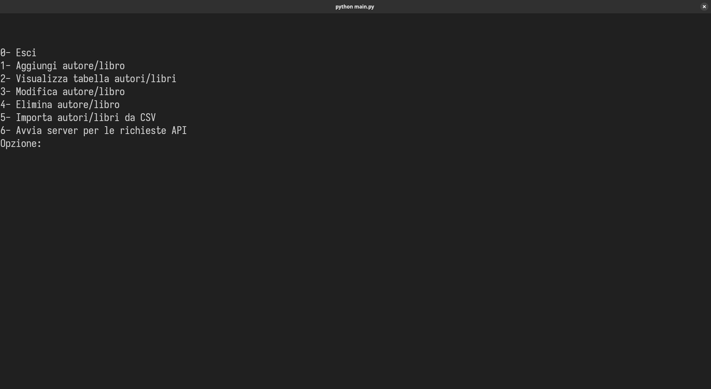
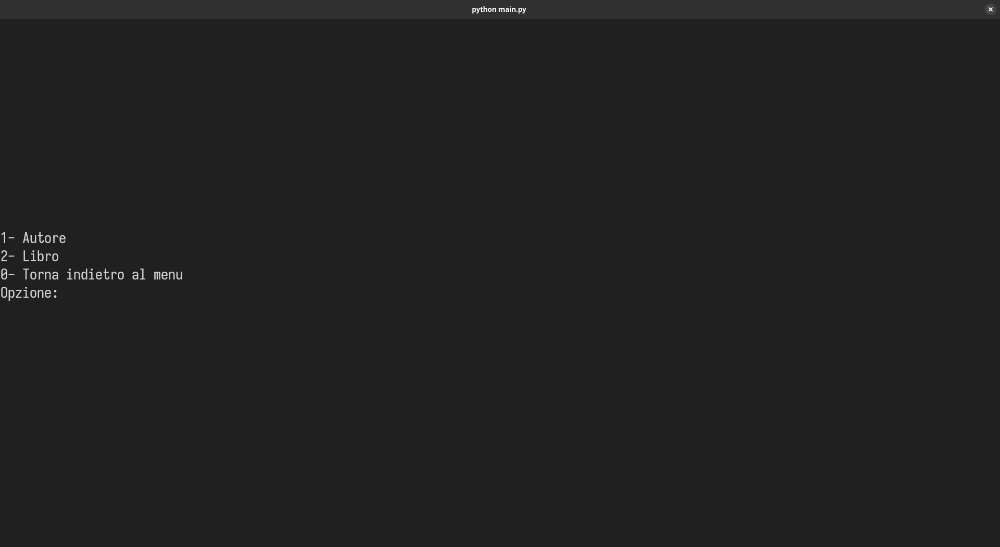
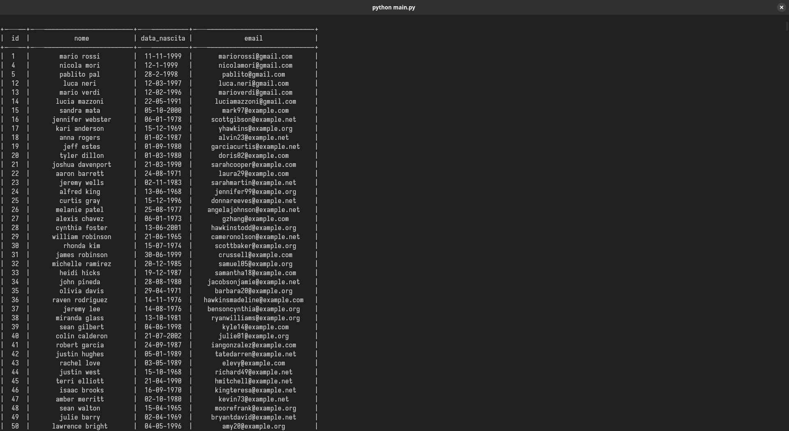
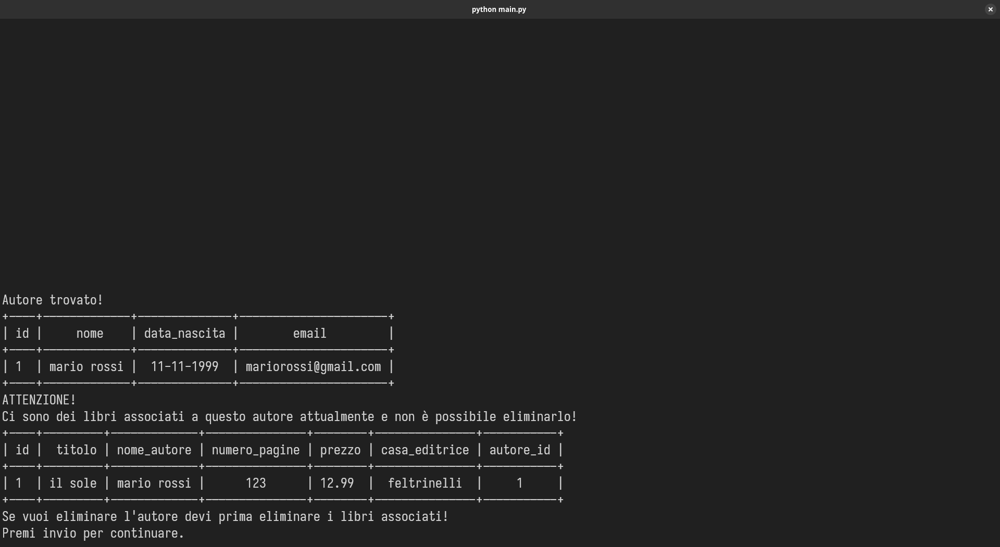
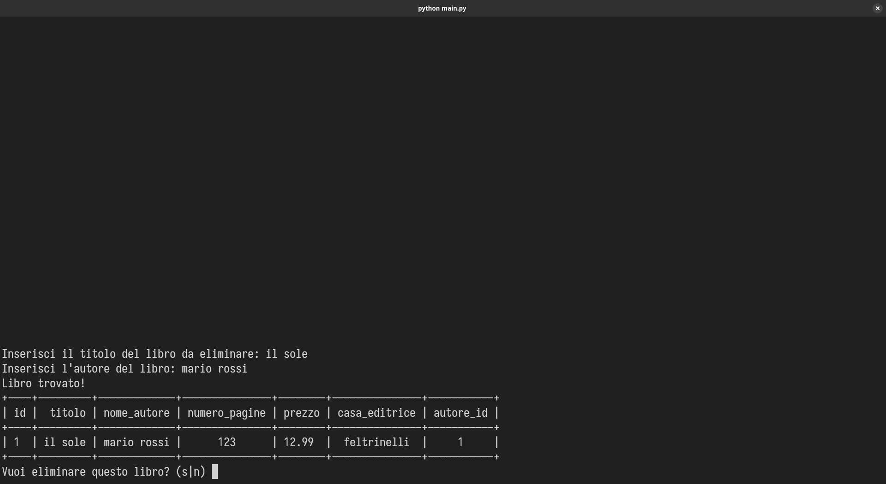
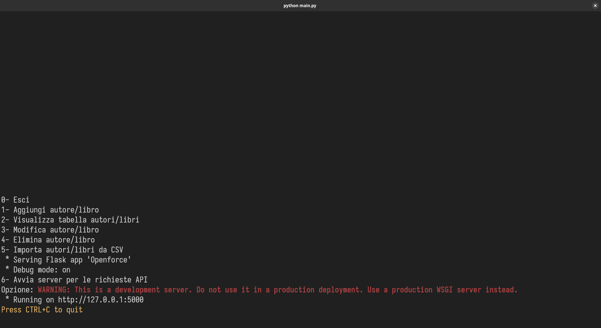
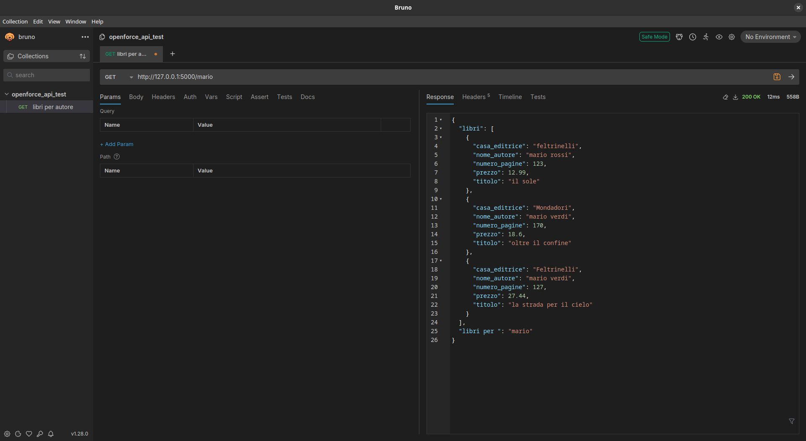
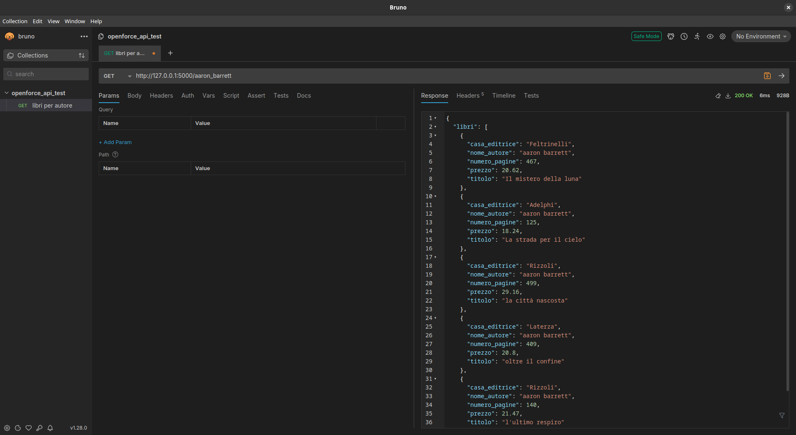
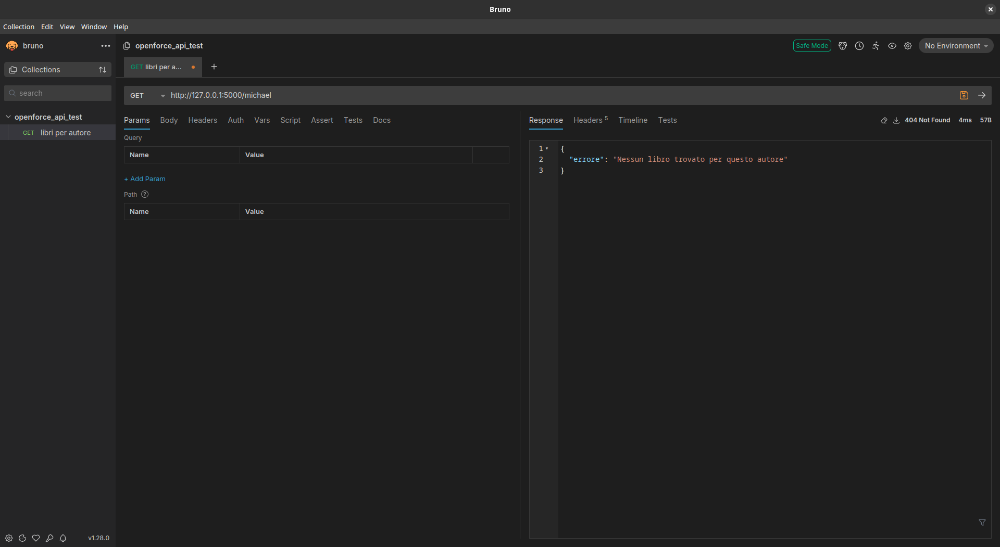
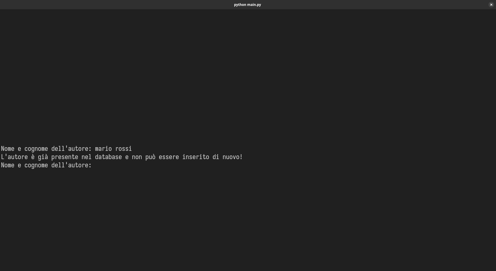

# Descrizione del progetto

Il progetto prevede lo sviluppo di un'applicazione CLI in **python** che permette di eseguire operazioni CRUD (Create, Read, Update, Delete) su una lista di **libri** ed **autori**. Inoltre permette l'import tramite file CSV di informazioni relative a queste due entità. Come ultima task, esegue un server locale un'API che gestisce richieste.

Le informazioni che caratterizzano l'entità "**libro**" sono: 

- `id`,`titolo`,`nome_autore`,`numero_pagine`,`prezzo`,`casa_editrice`

Mentre l'**autore** è composto da:

- `id`,`nome`,`data_di_nascita`,`email`

La memorizzazione dei dati viene gestita tramite **SQLITE**, mentre per le richieste API viene utilizzato **Flask**.

## Screenshots

</img> </img> </img> </img> </img> </img> </img> </img> </img> </img> 

# Istruzioni di installazione

Per poter eseguire il progetto è necessario innanzitutto clonare la repository con:

```
git clone https://github.com/Spargisale/openforce_challenge.git
```

Una volta clonata la repository sarà necessario spostarsi nella cartella:

```
cd openforce_challenge/
```

A questo punto sarà necessario creare e attivare un ambiente virtuale python:

```
python -m venv venv
```

E attivarlo tramite il seguente comando:

**Windows**

```
.\venv\Scripts\activate
```

**Linux**

```
source venv/bin/activate
```

Una volta attivato l'ambiente virtuale, sarà possibile vedere il prefisso `(venv)` nel terminale.

A questo punto sarà necessario installare le librerie contenute nel file `requirements.txt` utilizzando `pip`:

```
pip install -r requirements.txt
```

Una volta eseguiti questi passi, sarà possibile avviare il programma tramite il file principale `main.py`:

```
python main.py
```

# Elenco delle funzionalità

- **Inserimento**: è possibile inserire tramite CLI nuovi record con informazioni relative a libri ed autori nel database.

- **Modifica:** è possibile cercare nel database un libro o un autore di cui si vuole modificare le informazioni e il sistema aggiornerà automaticamente i record nel database con i nuovi dati.

- **Visualizzazione:** tutti i dati relativi alle tabelle dei libri e degli autori sono visualizzabili tramite CLI.

- **Eliminazione:** allo stesso modo della modifica, è possibile cercare un libro o un autore che si vuole eliminare. Il sistema implementa la clausola **RESTRICT** per gestire l'eliminazione; ciò significa che se ci sono associazioni tramite la chiave esterna, non sarà possibile eliminare i record desiderati; in particolare **non si può eliminare un autore che presenta dei libri associati senza prima eliminare tutti i record dei libri.**

- **Importazione dei dati tramite CSV:** sempre tramite CLI è possibile importare dati relativi ad autori e libri tramite file CSV precedentemente formattati. I file devono trovarsi nella cartella radice del progetto e devono essere nominati `libri.csv` e `autori.csv`.

- **Richieste API:** è possibile attivare (nel menu principale, all'apertura del programma) un server locale che gestisce richieste all' API. Attualmente è implementato (tramite richiesta `GET`) un endpoint dove è possibile inserire il nome dell'autore per trovare tutti i libri ad esso associati.

# Vincoli

- Quando si inserisci il `nome` dell'autore, non è possibile inserire un nome composto da una sola parola come ad esempio *"Luca"*, *"Paolo"* o *"Rossi"*, bisogna inserire un nome composto da almeno 2 parole come ad esempio *"Mario Rossi"* o *"Marco Rosario Marsili"*. 

- La `data di nascita` deve rispettare il formato `gg-mm-aaaa` o `gg-m-aaaa`. Inoltre non è possibile inserire giorni che non compongono il mese (ad esempio il 30 Febbraio).

- Il `prezzo` dei libri è espresso in float e per inserirlo correttamente bisogna utilizzare il punto come separatore decimale, come ad esempio *"12.75"* o *"39.99"*.

- L'`email` deve rispettare anch'essa il formato standard; non è possibile inserire parole uniche o più parole. Alcuni esempi di email sono *"lucarossi@example.it"*, *"mario.bianchi@gmail.com"* e così via.

- Una volta avviato il server per le richieste API, non sarà più possibile eseguire le altre operazioni da terminale, sarà necessario quindi terminare l'esecuzione del programma con `Ctrl+C` e rimandarlo in esecuzione.


